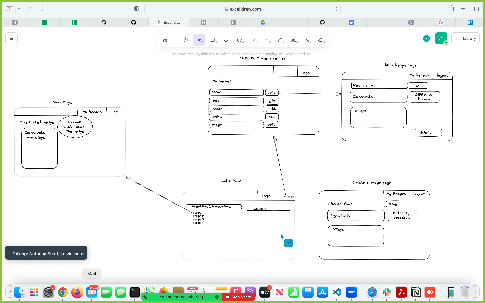

# Project-name-placeholder
## A. Description
Project-name-placeholder is a full-stack CRUD web application for hosting and sharing recipes fully equipped with accounts, authentication, details pages, all recipes page, my recipes page and more to come.

Project-name-placeholder's back-end architecture features a recipes router that uses RESTful routing to grab associated data. It also features an index router that uses google OAuth 2 in conjuction with Passport to add authentication for users

    Project-name-placeholder was built in X days by:
    Katherine Sprague - Database Manger/Backend/Project Manager/Frontend
    Kelvin Lanier - Frontend/Designer/Researcher/Backend
    Anthony Scott - Backend/Researcher/Documenter/Github Owner

## B. User Stories
    As a user, I want to able to create recipes  

    As a user, I want to be able to see my recipes and other people's recipes  

    As a user, I want to know how long a recipe will take to cook  

    As a user, I want to know how difficult a recipe is to cook before I buy all the ingredients  

   As a user, I want to be able to update my own recipes  

    As a user, I want to be able to delete my own recipes  

    As a user, I want to be able to filter the recipes by time of day(breakfast, lunch, dinner)  

    As a user, I want to be able to see recipes by category

## C. Images
>### MVP ERD

>###  Wireframe

## D. Technologies Used
> **Front-End**  

    1. Bootstrap

> **Back-End**  

    1. Node.js
    2. Express.js
    3. mongoDB
    4. Mongoose.js

> **Authentication**  

    1. Passport.js
    2. google 0Auth 2

> **Planning & Organization**  

    1. Trello

## E. Getting Started
> deployed project link here

1. Visiting the landing page will show you all the recipes made users on the site. If you want to add your recipes you will need to login.
2. Click the login button and sign-in using Google
3. Click the "Add Recipe" button. You will be redirected to a page with a form for creating a recipe. Fill out the form and click the "Add Recipe" button. Congratulations! You've made your first recipe.
4. You can click "My Recipes" to be redirected to a page that shows all the recipes you've created on Project-name-placeholder. From this page, you can click "Edit Recipe" on any of your recipes to make changes to them. You can also click "Delete This Recipe" to delete that recipe.
5. Click "Project-name-placeholder" to return to the home page that displays all the recipes made by every user. Using the dropdowns you can filter the recipes shown. Click any of the recipes shown to see the details of that recipe and leave a rating and comment

## F. Next Steps - Icebox Features via Users Stories
    As a user, I want to be able to customize my profile

    As a user, I want to have the option to delete my account
 